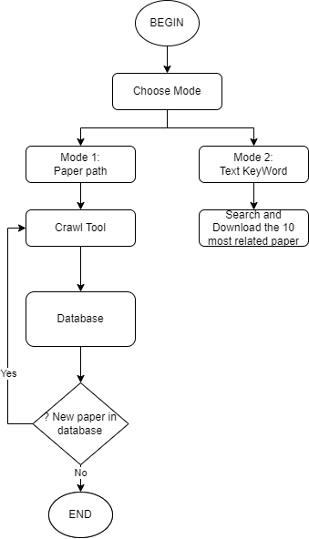

# Project Title

## Overview
This project allows users to search for academic papers on arXiv using specific keywords and download the corresponding PDFs.

## Installation
1. Clone the repository:
   ```bash
   git clone https://github.com/TunggTungg/crawl_tool.git
   ```
2. Navigate to the project directory:
   ```bash
   cd crawl_tool
   ```
3. Install the required packages:
   ```bash
   pip install -r requirements.txt
   ```

## Usage
To run the project, use the following command:

```bash
python main.py
```

Once the program is running, you can choose a mode to use:
- **Mode 1: Search by keyword**
  - Input a keyword to search for papers.
  - Optionally, specify the maximum number of results (default is 10).
  
  **Example:**
  ```
  Choose mode (1: Search by keyword, 2: Process PDF file path): 1
  Please input keyword: machine learning
  Please input max_result (default = 10): 5
  ```

- **Mode 2: Process PDF file path**
  - Input the path to a PDF file to process it.
  
  **Example:**
  ```
  Choose mode (1: Search by keyword, 2: Process PDF file path): 2
  Please input paper path: output/sample_paper.pdf
  ```

## Flowchart
Below is a flowchart that illustrates the process of searching and downloading papers:

<p align="center">
  
</p>

## Future Work
- [ ]  **User Interface**: Develop a graphical user interface (GUI) to enhance user experience.
- [ ]  **Advanced Search Options**: Implement filters for date, author, and category to refine search results.
- [ ]  **Batch Processing**: Allow users to input multiple keywords or file paths for batch processing.
- [ ]  **Integration with Other Databases**: Expand the project to include searches from other academic databases.
- [ ]  **Error Handling**: Improve error handling and user feedback for invalid inputs or network issues.
- [ ]  **Data Export**: Add options to export search results as CSV or JSON for further analysis.

## Contributing
If you would like to contribute to this project, please fork the repository and submit a pull request.

## License
This project is licensed under the MIT License - see the [LICENSE](LICENSE) file for details.